# Walmart Recruiting - Store Sales Forecasting

## პრობლემის აღწერა

** Walmart გაყიდვების პროგნოზირება

ამ პროექტში, ჩვენი მიზანია ვოლმარტის 45 სხვადსხვა მაღაზიაში თითოეული განყოფილების (დეპარტამენტის) კვირის გაყიდვების წინასწარმეტყველება ისტორიული მონაცემების საფუძველზე.

**გამოწვევები:**

- **სეზონური რყევები**: გაყიდვები მნიშვნელოვნად იცვლება სხვადსხვა დროის პერიოდებში. განსაკუთრებით მნიშვნელოვანი სეზონები არის საშობაო კვირა, Thanksgiving და სხვა დღესასწაულები.

- **აქციების გავლენა**: Walmart-ს წლის განმავლობაში აქვს აქციები, ეს აქციები გავლენას ახდენენ გაყიდვებზე, მაგრამ რომელი დეპარტამენტები არიან უფრო მეტად დატვირთულები - რთული დასადგენია.

- **დღესასწაულების წონითი სიმძიმე**: ოთხი ძირითადი დღესასწაული (Superbowl, Labor day, Thanksgiving და Christmas) შეფასებისას 5 ჯერ უფრო მნიშვნელოვანია, ვიდრე ჩვეულებრივი კვირები.

- **შეზღუდული ისტორია**: გაყიდვების მოდელირება რთულია, რადგან თითოეული დღესასწაული წელიწადში მხოლოდ ერთხელ მოდის - ამიტომ გვაქვს შეზღუდული მონაცემი სეზონური შაბლონების დასაფიქსირებლად.

**მიზანი**: მშენიდობა მანქანა სწავლის მოდელი, რომელიც ზუსტად წინასწარმეტყველებს ყოველკვირეულ გაყიდვებს, რათა ვალმარტმა შეძლოს უკეთ დაგეგმოს მარაგი, შემოსავალი და ახალი ინვესტიციები.

## რეპოზიტორის სტრუქტურა
 
```
walmart-store-sales-forecasting/
├── README.md                          # დოკუმენტაცია
├── .gitignore                         # Git ignore rules
├── walmart_preprocessing.py           # პრეპროცესინგი/ feature engineering
├── walmart_ts_common.py               # Common utilities (MLflow, metrics, helpers)
│
│   ├── xgboost_model_experiment.ipynb          # XGBoost  
│   ├── lightgbm_model_experiment.ipynb         # LightGBM 
│   ├── model_experiment_nbeats.ipynb           # N-BEATS 
│   ├── model_experiment_prophet.ipynb          # Prophet 
│   ├── model_experiment_dlinear.ipynb          # DLinear 
│   ├── model_experiment_patchtst.ipynb         # PatchTST
│   └── feature-engineering.ipynb               # Feature exploration / EDA
│
├── images/
│   ├── dlinear_actualsVspredicted.png
│   ├── dlinear_trainVsval.png
│   ├── patchtst_actualsVspredicted.png
│   ├── prophet_actualsVspredicted.png
│   ├── prophet_trainVsval.png
│   ├── nbeats_*.png
│   ├── xgboost_*.png
│   ├── lgbm_*.png
│   └── weekly_sales.png
│
└── feature-engineering.py            # Feature engineering utilities
```
 
## Train/Val/Test Split

რადგან გვაქვს დროის ამოცანა, რენდომად არ უნდა დავყოთ დატასეტი. ამიტომ ავიღე ისე, რომ ბოლო **8 კვირა** არის ყოველთვის ვალიდაციის სეტი და დანარჩენი არის მთლიანად ტრენინგის სეტი.
ეს საკმარისად დიდი დროა იმისთვის, რომ `holiday`-იც მოუწიოს ხოლმე ვალიდაციისას, რომელიც განსაკუთრებით მნიშვნელოვანია ჩვენთვის, რადგან 5-ჯერ დიდი წონა აქვს მაგ მონაკვეთში სწორ prediction-ებს.

---

## Feature Engineering

თავდაპირველად `outlier`-ები მოვაშორე დატასეტს, დაახლოებით **+-4.5σ**-ზე მეტი რაც იყო თითოეულ feature-ში `interquartile range`-ის გამოყენებით ვიპოვე და უბრალოდ clipping გავუკეთე, ანუ რაღაც ზღვარზე მეტი რიცხვი აღარ მაქვს დატასეტში, დაახლოებით **1.75%** იყო ასეთი outlier.
ასევე ამ მონაცემებში გვხვდება უარყოფითი `Sales` მაჩვენებელი, რაც ნიშნავს რომ გადაჭარბებული გაყიდვები გვქონდა მაგ კვირაში. ეს არაა საჭირო და გვიფუჭებს დატასეტს, უარყოფითი შემოსავალი არ უნდა დააფრედიქთოს მოდელმა, ამიტომ ესეც clipping-ით მოვაგვარე .

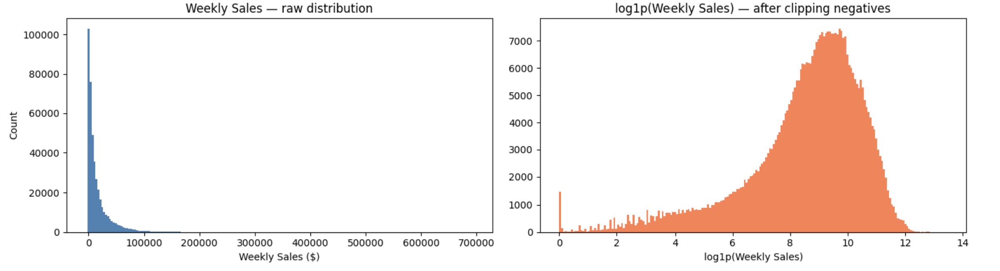

> *ამ გრაფიკზე არ ჩანს უარყოფითი Sales კარგად, რადგან მხოლოდ 0.3%-ია მთლიანი დატასეტის, მაგრამ ეგ პრობლემა მოვაგვარეთ მოკლედ.*

შემდეგი, რაზეც ყურადღებაა გასამახვილებელი არის კალენდარის Feature-ები. პირველი კვირა და 52-ე კვირა დროში ახლოსაა ერთმანეთთან, მაგრამ რიცხვობრივად ძალიან შორსაა.
ამიტომ შემოვიღეთ სინუსის და კოსინუსის feature უბრალოდ კვირის ნომრის გარდა, რათა ციკლური ყოფილიყო როგორც რეალურ ცხოვრებაში და ეს კანონზომიერება დაეჭირა მოდელს.

* ასევე დავამატეთ `Weeks_elapsed` feature, რომელიც ზოგადად რამდენი კვირა გავიდა პირველი კვირიდან მაგას ითვლის, რათა დროის შეგრძნებაც გვქონდეს.
* კიდევ გვაქვს `WeekofMonth` feature, რომელიც თვის რომელი კვირაა მაგას გვიჩვენებს და ეხმარება მოდელს მაგალითად ხელფასის კვირების კანონზომიერების დაჭერაში (თუნდაც იმას რომ იზრდება ხელფასის კვირებში ხალხის ხარჯები).

Holiday feature-ებს რაც შეეხება, რადგანაც ეს ძალიან მნიშვნელოვანია ჩვენი მოდელისთვის, ამაზე გავამახვილეთ ყურადღება ძალიან. 
Raw დატასეტში უბრალოდ `isHoliday` ველი გვაქვს, მაგრამ Holiday-მდე 2-3 კვირით ადრე იწყება ხოლმე მზადება, ამიტომ ამას ვერ ისწავლის მოდელი თუ ასე დავტოვებთ.
ამის მოსაგვარებლად შემოვიღე `isSigned` ველი, რომელიც აბრუნებს უარყოფით რიცხვებს Holiday-მდე და შემდეგ დადებითს. ამით მოდელს შეეძლება დღესასწაულის წინა დღეების და შემდეგი დღეები გაარჩიოს ერთმანეთისგან.

ასევე სხვადასხვა დღესასწაულები გამოვყავით ცალკე ველებად, შემოვიღეთ `Days_to_{name}` და `Days_post_{name}` ველები, რადგან სხვადასხვა დღესასწაულზე არსებული pattern-ებიც ვისწავლოთ.

რადგან გვაქვს time-series data, შემოვიღეთ `lag` feature-ები. ეს ნიშნავს, რომ მაგალითად 1 კვირის წინ არსებული მონაცემები, 4 კვირის წინ, 1 წლის წინ, ყველაფერი ცალკე ველებად არის დამატებული.
უმეტესობა დღესასწაულების წელიწადის ერთიდაიგივე პერიოდშია, ამიტომ ასეთი დაყოფა მოდელს საშუალებას მისცემს ზუსტად იმას მიაქციოს ყურადღება, რაც დიდი ალბათობით გამოადგება და ისწავლოს ცვლილება დროში.

ასევე დავამატეთ feature, რომელიც წინა 4 კვირიან საშუალო sale-ებს კონკრეტული დღიდან ყოფს 1 წლის წინ არსებულ ზუსტად იგივე მონაკვეთში საშუალოზე, ეს მოდელს საშუალებას აძლევს ისწავლოს კონკრეტული მაღაზიის შემოსავალი იზრდება თუ მცირდება.

დამატებული გვაქვს `rolling` სტატისტიკებიც, რაც ინდივიდუალური lag მნიშვნელობების ხმაურის გაფილტვრის საშუალებაა და უფრო სტაბილურ ინფორმაციას აძლევს მოდელს. 

`MD_total`, `MD_count`, `MD_max`, `MD_nonzero_mean` ველები შევქმენით, რაც აღწერს Markdown Event-ებს უფრო ზოგადად და ეფექტიანად, ვიდრე დატასეტშია.
ცალკე გამოვყავით Holiday Markdown Event-ების ველები, რადგან მოდელმა დააფიქსიროს, რომ Holiday-ის დროს აქციებს სხვა გავლენა აქვს და ჩვეულებრივ დღეებში სხვა.

`Store` და `Dept` კატეგორიულ ველებს გავუკეთეთ target encoding, ანუ წინა ველების საშუალო target მნიშვნელობით ჩავანაცვლეთ (იმ კონკრეტული დროის ჩაუთვლელად, რომლისთვისაც ვითვლით).
დავამატეთ ცვლადები როგორიცაა `store_dept_week_mean`, რაც მოდელს ასწავლის კონკრეტული მაღაზიის და კონკრეტული დეპარტამენტის კავშირებს.

დავამატეთ მაკროეკონომიკური ცვლადების ნამრავლი, მაგალითად უმუშევრობის კოეფიციენტის ნამრავლი აქციების რაოდენობაზე.

---

## XGBoost Training

XGBoost-ის ტრენინგისას, დავტესტე სხვადასხვა ჰიპერპარამეტრები. შედეგები ასეთი გამოვიდა:

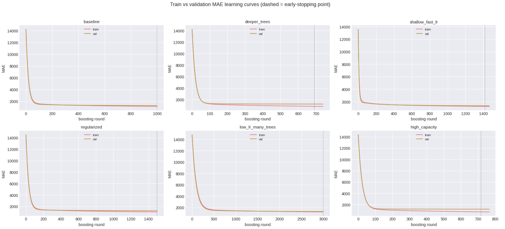

`high_capacity` ან `deeper_trees` მოდელის გარდა ყველა დაახლოებით იგივენაირია, ეს ორი სხვებზე უარესია რადგან ოვერფიტისკენ უფრო მიდრეკილია.

ამ მოდელების feature importance-ები როცა ვნახე, მივხვდი, რომ `roll_max_52w` feature ხელს უშლიდა მოდელს, რადგან თითქმის მთლიანი მოდელი ამ ერთ მონაცემს ეყრდნობოდა.

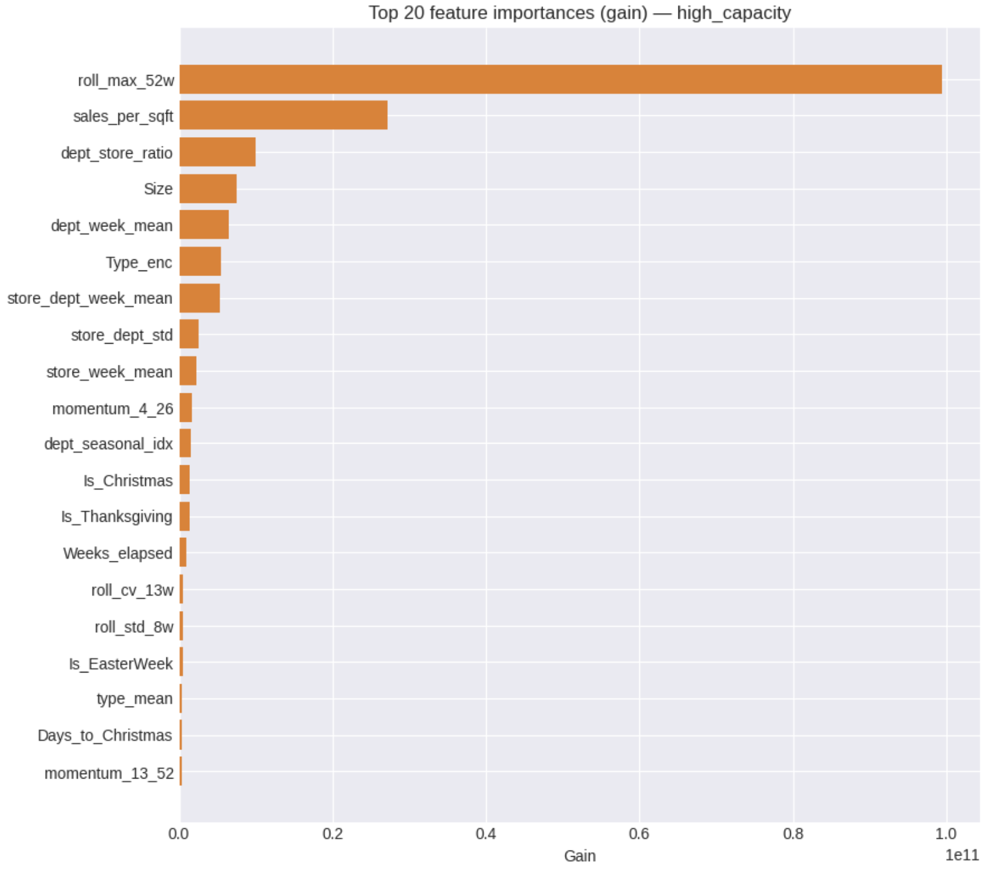

ეს feature engineering-ის ბოლოსაც შეიმჩნეოდა, რადგან თარგეთთან კორელაცია ჰქონდა 95% დაახლოებით. ამის გამო გადავწყვიტე ამ feature-ის მოშორება და ისე დატრენინგება მოდელების.
ეს რომ დამეტოვებინა, განზოგადება გაუჭირდებოდა მოდელს ჩემი აზრით, რადგან ზარმაცად მხოლოდ ამ ერთ მახასიათებელს მიაქცევდა ყურადღებას.

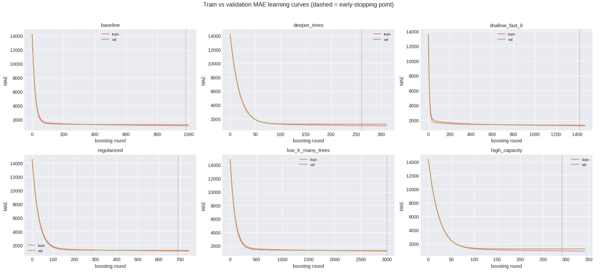

როგორც ვხედავთ, მოდელებზე დიდი გავლენა არ მოახდინა ამ ინფორმაციის ამოღებამ, მაგრამ სამაგიეროდ ბევრად დაბალანსებული feature importance გვაქვს.

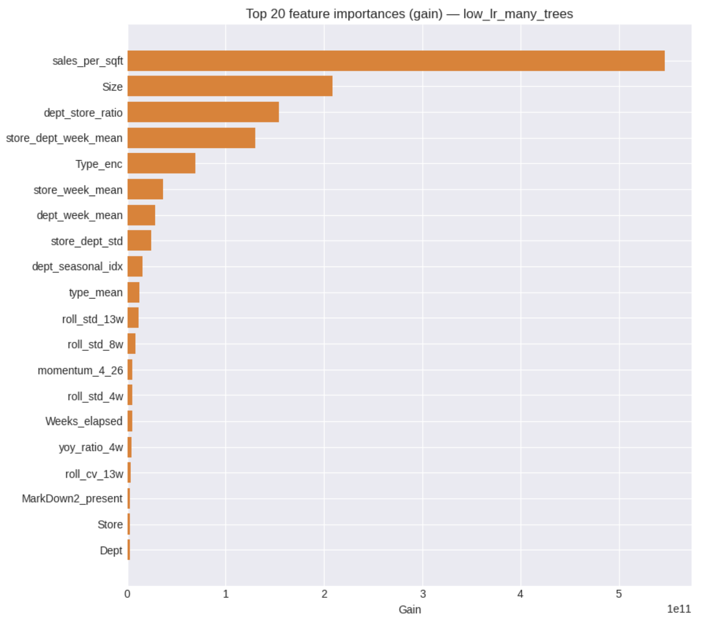

საუკეთესო მოდელად აქ ავირჩიე `low_lr_many_trees`, რადგან ოვერფიტში არ მიდიოდა და თან ყველაზე დაბალი ვალიდაციის ერორი ჰქონდა.

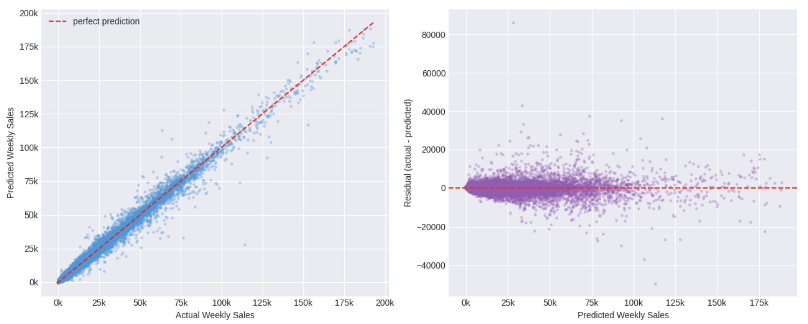

ამ გრაფიკზე ვხედავთ მოდელის prediction-ებს და რეალურად რისი დაბრუნებაც გვინდა იმ რიცხვებს შორის კავშირს. სტანდარტულ დღეებში კარგად იცნობს მოდელი გაყიდვების რაოდენობას, მაგრამ რაც უფრო იზრდება გაყიდვები, holiday დღეებში ანუ, მით უფრო უჭირს მოდელს გამოცნობა. მოდელს ჰგონია, რომ 5000$-ით აცდენა 8000$ გაყიდვებზე იგივეა, რაც მაგალითად 150000$ გაყიდვებზე. 
ეს ასე არაა ამიტომ ამის გამოსასწორებლად დავატრენინგოთ თარგეთის ლოგარითმზე, რომ ამის აღქმაც მივცეთ.

ასევე ერთი outlier-ია, რომელშიც ძალიან ავცდით პასუხს, **80000$** residual გვაქვს და ამასაც უნდა მივხედოთ.

მაგ outlier-ს ჩავხედე და მართლა outlier-ია, ყველა წლის სექტემბრამდე იზრდებოდა იქამდე გაყიდვები და ეგრევე მკვეთრად ეცემოდა მერე. აქ რატომღაც დაიგვიანა და ცოტა მერე ავიდა პიკში, როცა მოდელს ეგონა რომ უკვე კლება უნდა დაეწყო.

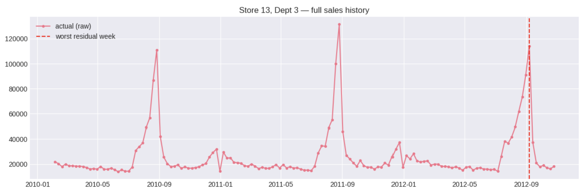

დანარჩენი უკვე ჰიპერპარამეტრების ოპტიმიზაციაა, რენდომ სერჩი გავუშვი და საუკეთესო მოდელის შედეგები ასეთი გამოვიდა:

```yaml
train_wmae: 1207.85
val_wmae:   1320.35
```


## LightGBM Training

LightGBM-ის ტრენინგი თითქმის იგივენაირია, რაც XGBoost. LightGBM-ის უპირატესობა ისაა, რომ უფრო ჩქარია და loss ფუნქციის ყველაზე მეტად შემამცირებელ leaf-ს ამატებს ყოველ ჯერზე.

აქ უბრალოდ სხვა ჰიპერპარამეტრები გვაქვს.

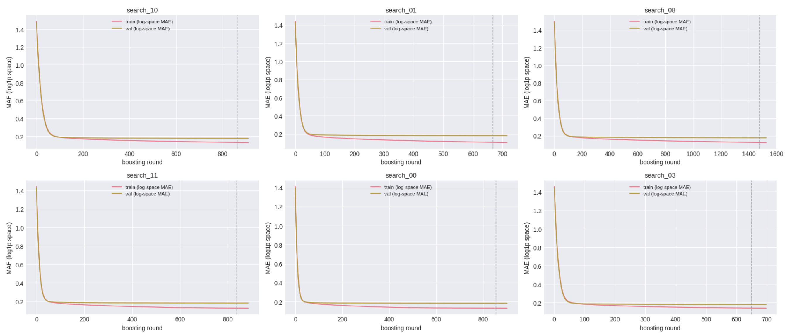


ამ გრაფიკზე ვხედავთ, რომ LightGBM-იც იგივენაირ შედეგს გვაძლევს, რასაც XGBoost, რაც მოსალოდნელი იყო, რადგან ხის მოდელებია ორივე და მსგავსია ერთმანეთის.


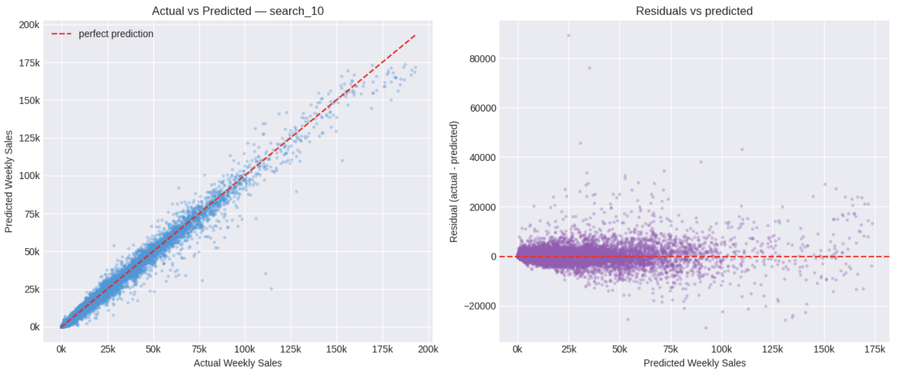

აქაც იგივე სიტუაციაა, ის ერთი outlier ისევ არის და რაც უფრო დრო გადის ისევ უფრო და უფრო უჭირს მოდელს გამოცნობა.


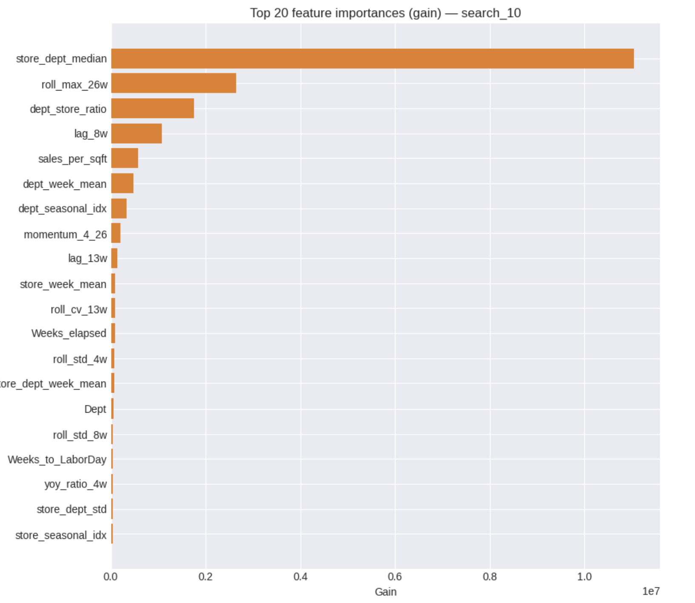

ვალიდაციის შედეგი ყველაზე კარგი რომელ მოდელსაც ჰქონდა, იმის feature importance ასე გამოიყურება. ეს არ მომწონს, რადგან პირველ feature-ზეა დამოკიდებული მთლიანად.
ამიტომ სხვა მოდელებსაც ვნახავ და უკეთესი შედეგი რომელსაც ექნება ამ მხრივ იმას ავირჩევ.

ამის გათვალისწინებით, საუკეთესო მოდელის შედეგი გამოვიდა:

```yaml
train_wmae: 1312.88
val_wmae:   1316.14
```

ეს ბევრად უკეთესია, ვიდრე XGBoost-ის საუკეთესო მოდელი, ბევრად ნაკლებად არის მიდრეკილი ოვერფიტისკენ. ჩემი გამოცდილებით LightGBM მოდელი ამით სჯობს XGBoost-ს.


## N-BEATS Training

N-BEATS არქიტექტურა იყენებს ჩვეულებრივ წრფივ Layer-ებს და ერთდროულად output-ზე აქვს Forecast და Backcast ბლოკები, ანუ რა ისწავლა შესული მონაცემებიდან და მომავალი prediction.

N-BEATS-ის ეფექტურობას განსაზღვრავს Residual Stacking არქიტექტურა. გვაქვს ბევრი წრფივი ბლოკი, როცა ერთი ბლოკი დაასრულებს დამუშავებას, forecast და backcast-ს გამოუშვებს და residual-ს გამოაკლებს შემდეგი ბლოკის ინფუთს.
ეს საშუალებას აძლევს მოდელს, რომ სხვადასხვა ბლოკმა სხვადასხვა pattern-ები ისწავლოს.


ასევე სხვადასხვა stack-ებს შეგვიძლია მივანიჭოთ ადამიანისთვის გასაგები ინტერპრეტაცია, მაგალითად გვქონდეს სეზონური სტეკი და ტრენდის სტეკი. ანუ ერთმა მაღალი სიხშირის სიგნალები ისწავლოს მეორემ დაბალი.


თავიდან დავატრენინგე უბრალოდ კლასიკური N-BEATS, რომელიც მხოლოდ და მხოლოდ გაყიდვების და დროის ინფორმაციებს იღებს. ამ მოდელს არ ჰქონდა კარგი შედეგი, ყველაზე კარგი იყო 2200-მდე WMAE.

ამის შემდეგ მოვიძიე N-BEATS-ის გაუმჯობესებული ვერსია, N-BEATSx, რომელიც ამ ინფორმაციის გარდა ასევე იღებს ნებისმიერ დამატებით feature-ებს რაც ჩვენ გვინდა.


დავამატე ძირითადი feature-ები, რაც გვქონდა feature engineering-ის დროს და ამან ბევრად გააუმჯობესა მოდელის შედეგები.

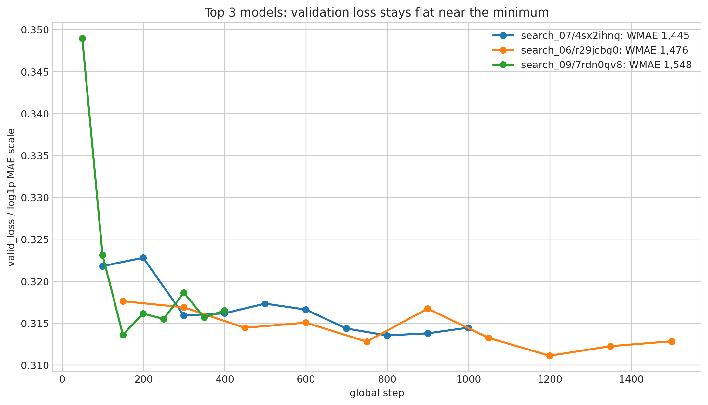

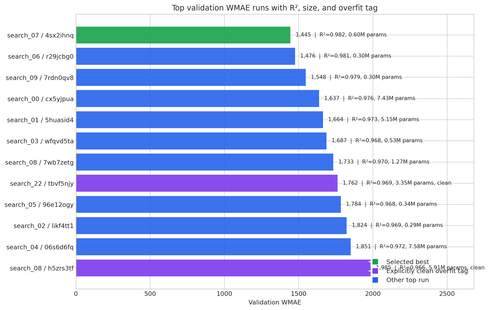

როგორც ვხედავთ, უფრო პატარა მოდელი გამოდგა უკეთესი, დანარჩენებმა უარესი შედეგები აჩვენეს. ეს ხდება იმიტომ რომ დიდი მოდელები overfit-ში მიდიან უფრო მარტივად.


ამ მოდელში ჰიპერპარამეტრები გვაქვს dropout, input_size და batch_size. input_size ავიღე მაქსიმუმ 26-მდე, რაც მოდელს საშუალებას აძლევს, რომ 208 კვირამდე მონაცემებს უყუროს წარსულში.

შემდეგ გავაკეთე Random Search და მოდელების შედეგები ასეთი გამოვიდა:


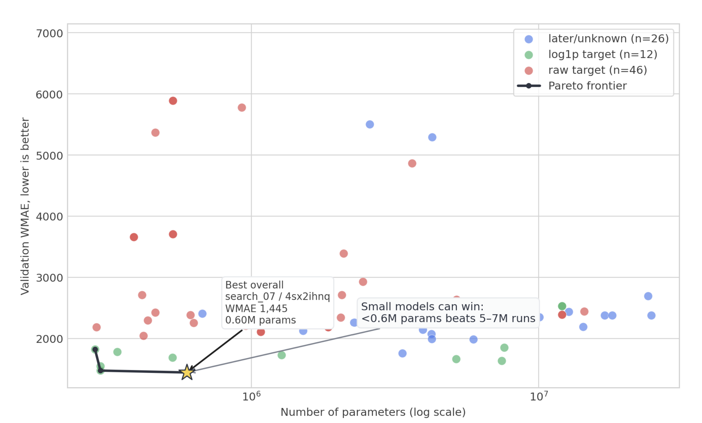


პირველივე მოდელი რაცაა ეგ ავირჩიე, რადგან შევამოწმე და overfitted არ იყო.


```yaml
Train log1p MAE: 0.2532
Validation log1p MAE: 0.3179
Validation WMAE: 1,444.52
```


## TFT Training


---
 
## Prophet Training
 
XGBoost/LightGBM ერთ მოდელს წვრთნის მთელ დატასეტზე, Prophet კი პირიქით —
ცალკე მოდელი ეგუება თითოეულ ~3,000 (Store, Dept) მწკრივს ცალ-ცალკე.
თითოეული სწავლობს ტრენდს, წლიურ სეზონურობას და დღესასწაულების ეფექტს.
 
დღესასწაულებს იგივე `HOLIDAYS` თარიღები აქვს, რაც ხის მოდელებში, უბრალოდ
Prophet-ის თავისი `holidays` ინტერფეისით, რომელსაც `holidays_prior_scale` არეგულირებს.
 
საბაზისო მოდელი: additive სეზონურობა, `changepoint_prior_scale=0.05`,
`holidays_prior_scale=10`, `yearly_order=10`, `min_history=104`.
 
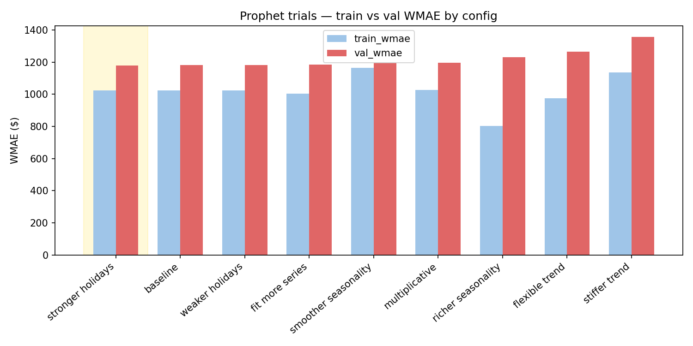
 
| იტერაცია | ცვლილება | train_wmae | val_wmae |
|---|---|---|---|
| baseline | `seasonality_mode` → additive | 1023.35 | 1181.83 |
| multiplicative | `seasonality_mode` → multiplicative | 1025.14 | 1196.28 |
| მოქნილი ტრენდი | `changepoint_prior_scale` → 0.5 | 976.00 | 1265.80 |
| ხისტი ტრენდი | `changepoint_prior_scale` → 0.01 | 1136.05 | 1357.32 |
| სუსტი holiday | `holidays_prior_scale` → 1.0 | 1023.30 | 1182.71 |
| **ძლიერი holiday** | `holidays_prior_scale` → 20.0 | 1023.35 | **1179.47** |
| მდიდარი სეზონურობა | `yearly_order` → 20 | 803.38 | 1229.33 |
| გლუვი სეზონურობა | `yearly_order` → 6 | 1164.67 | 1194.70 |
| მეტი მწკრივი | `min_history` → 60 | 1004.26 | 1183.88 |
 
საუკეთესო შედეგი `holidays_prior_scale=20`-მ მოიტანა.
ანუ ამ მწკრივებს დღესასწაულებზე მეტი აქცენტი
სჭირდებათ და არა ნაკლები, რაც ლოგიკურია, რადგან holiday კვირებს 5x წონა
აქვთ. ტრენდის knob-ს კი არც მოშვება და არც გამკაცრება არ დაეხმარა.
 
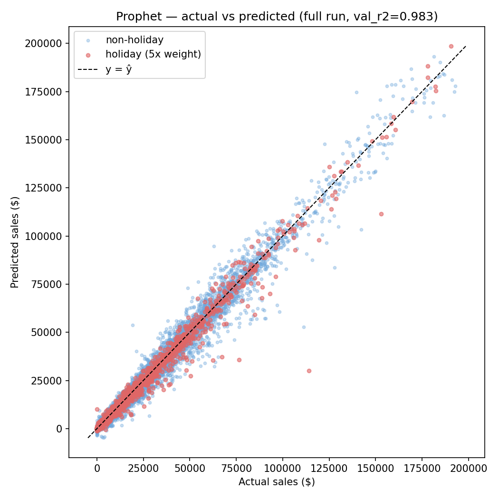
 
```yaml
train_wmae: 1023.35
val_wmae:   1179.47
```
 
---
 
## DLinear Training
 
DLinear სამიდან ყველაზე მარტივია, მწკრივს დეკომპოზიციას უკეთებს ტრენდად და სეზონურ ნაწილად
(moving average-ით) და თითოეულს წრფივ Layer-ში ატარებს, შემდეგ კი კრებს.
სულ რამდენიმე ასეული პარამეტრია. Prophet-ისგან განსხვავებით, ეს ერთი
მოდელია, რომელიც ყველა მწკრივზე ერთად ტრენინგდება.
 
baseline: 52-კვირიანი lookback ( რა დროის ნაწილს შეხედოს წარსულში ) , 8 კვირა წინ ( რამდენი ხნის დატა უნდა დააპროგნოზოს) , `kernel_size=25` ( Moving average-ს რომ გადავატარებთ მისი  ), 40 ეპოქა,
`lr=1e-3`.
 
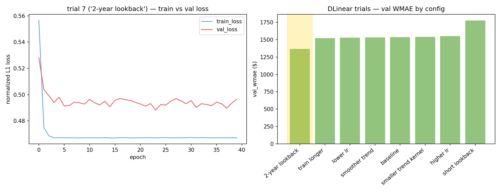
 
| იტერაცია | ცვლილება | train_wmae | val_wmae |
|---|---|---|---|
| baseline | — | 1700.94 | 1538.08 |
| მაღალი LR | `lr` → 0.003 | 1701.85 | 1550.26 |
| დაბალი LR | `lr` → 0.0003 | 1699.42 | 1529.67 |
| პატარა kernel | `kernel_size` → 13 | 1701.92 | 1540.41 |
| დიდი kernel | `kernel_size` → 51 | 1699.51 | 1532.82 |
| მოკლე lookback | `input_len` → 26 | 2432.41 | 1775.65 |
| **2-წლიანი lookback**  | `input_len` → 104 | **1247.04** | **1366.70** |
| მეტი ეპოქა | `epochs` → 80 | 1703.86 | 1522.18 |
 
აქ მთავარი ბერკეტი lookback-ის სიგრძე აღმოჩნდა — 104 კვირამდე გაზრდამ
val_wmae 1538-დან 1366-მდე ჩამოწია, ყველაზე დიდი ნახტომი. learning rate
და kernel_size თითქმის არაფერს ცვლიდა. overfit არ ჩანს, train და val
ერთად ეცემა.
 
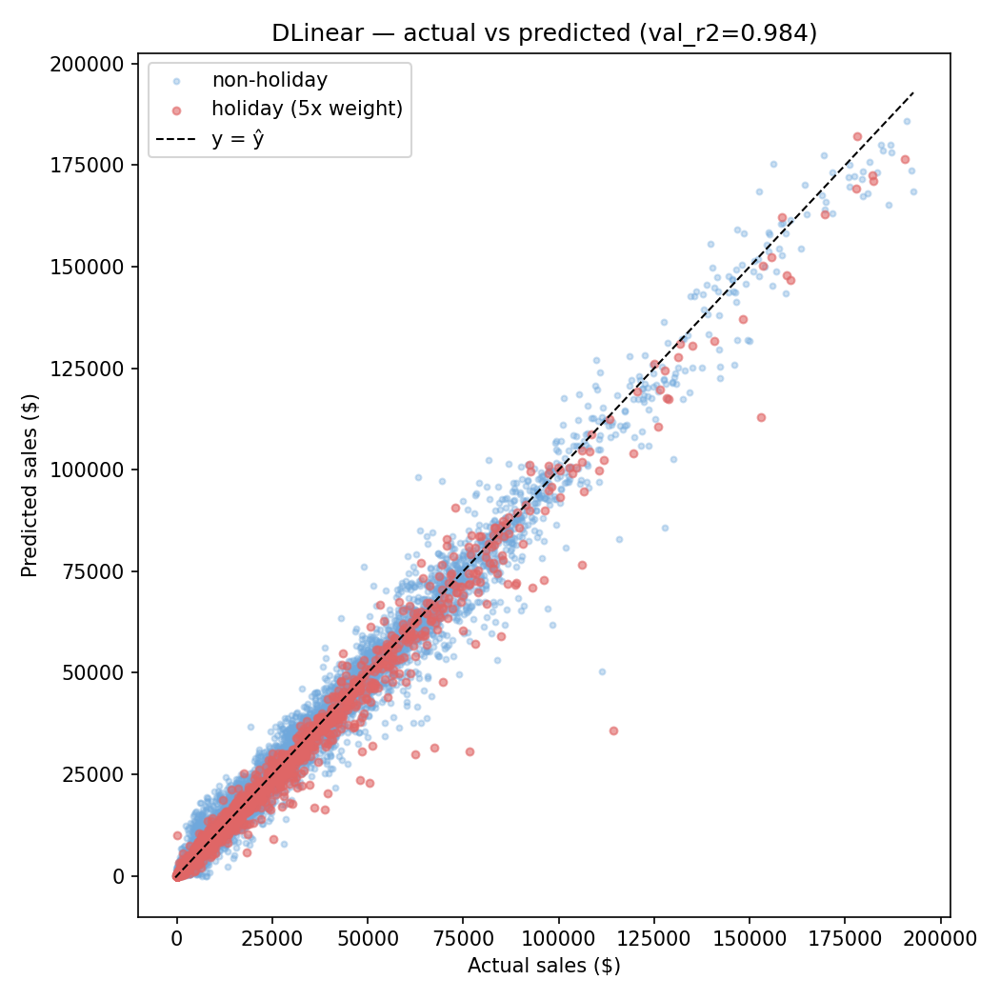
 
```yaml
train_wmae: 1247.04
val_wmae:   1366.70
```
 
---
 
## PatchTST Training

 
PatchTST პატარა transformer-ზე დაფუძნებული მოდელია, რომელიც იღებს მწკრივს და ჭრის რამდენიმე ნაწილად (Patches), ამ პაჩებს ატარებს ჯერ წრფივ ლეიერში, რომ მივიღოთ ემბედინგები, შემდეგ კი ვატარებთ ტრანფორმერში, რომელსაც გააჩნია რამდენიმე head, იმისთვის რომ სხვადასხვა კავშირი შეისწავლოს ამ ინფორმაციას შორის, აქედან გამომავალი ბრტყელდება და გადის წრფივ ლეირში.
  
baseline: იგივე 52/8 lookback/horizon ( წარსულის რა ნაწილს ვუყურებთ , მომავლის რა ნაწილი უნდა ვიწინასწარმეტყველოთ ) , 13-კვირიანი patches, 128-ის
სიგანის, 3-ფენა ( ტრანსფორმერების რაოდენობა ) , 8-თავიანი encoder ( head-ების რ.ობა).
 
 
| იტერაცია | ცვლილება | train_wmae | val_wmae |
|---|---|---|---|
| baseline | — | 1075.19 | 1374.97 |
| 2 ფენა | `depth` → 2 | 1122.47 | 1388.49 |
| **ვიწრო (d_model 64)**  | `d_model` → 64 | **1129.66** | **1347.70** |
| ფართო (d_model 256) | `d_model` → 256 | 1059.83 | 1416.82 |
| წვრილი patches | `patch_len`/`stride` → 4 | 1073.56 | 1442.91 |
| გადამფარავი patches | `patch_len` → 26 | 1067.04 | 1372.80 |
| მეტი dropout | `dropout` → 0.2 | 1141.36 | 1364.34 |
| მაღალი LR | `lr` → 0.003 | 1152.28 | 1403.96 |
| 2-წლიანი lookback | `input_len` → 104 | 800.40 | 1500.09 |
| მოკლე lookback | `input_len` → 26 | 1704.55 | 1567.02 |
 
აქ პირიქით — უფრო პატარა მოდელი (`d_model=64`) აღმოჩნდა საუკეთესო. მეტი
სიგანე უბრალოდ overfit-ს უკეთებდა. საინტერესოა,
რომ 2-წლიანმა lookback-მა აქ პირდაპირ overfit მოიტანა (train ჩამოვარდა
800-მდე, val კი გაუარესდა) — DLinear-ში ზუსტად იგივე ცვლილება საუკეთესო
იყო.
 
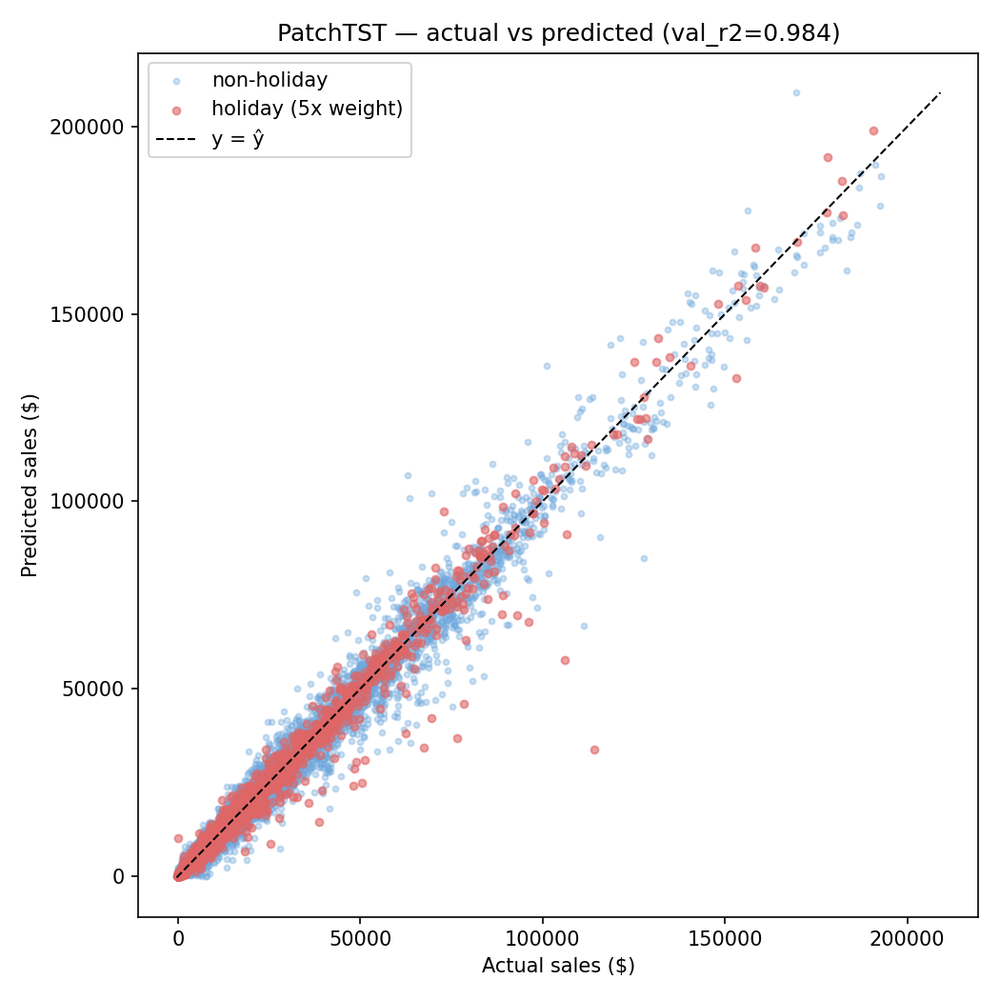
 
```yaml
train_wmae: 1129.66
val_wmae:   1347.70
```
